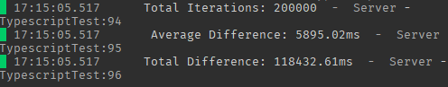
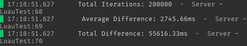

# Purpose
This repo was made just to test the performance difference between native luau and typescript through the [roblox-ts](https://github.com/roblox-ts/roblox-ts) workflow.

## Findings
After several simulations, it has been concluded that the roblox-ts workflow has performance issues. These issues should not be a big deal in production code and the benifits outweight the losses. However, this repo is just here as an experiment and a warning to those that need the most performance out of their code. My findings were that roblox-ts, on average, takes approximately twice (2x) as long as the luau counterpart. Keep in mind this is based on a single function and method.

#

Typescript benchmarks:



Results:
* Simulation was repeated 20 times
* Each iteration ran the main loop 10,000 times
* Average simulation time: 5895.02ms 
* Total simulation time: 118432.61ms 

#
Luau benchmarks:



Results:
* Simulation was repeated 20 times
* Each iteration ran the main loop 10,000 times
* Average simulation time: 2745.66ms 
* Total simulation time: 55616.33ms

### Note
I personally love typescript and am using it for many of my projects. This experiment is not going to convince me to stop using it and this should not be the reason you stop either.

This test is not a proper representation of the real-world performance of roblox-ts and therefore should not be taken as such. It is just to stress for long enough to calculate the performance differences.

This test was designed to stress test some of the specific functionalities that roblox-ts makes more readable, scalable, and writeable. One of those thigns is the class decleration and extension. I tried to keep the code as similar as possible between luau and typescript while writing it and tried to code as I would if I had no experience with the other language.

I'm aware the code tests a very inefficient algorithm but that is by choice. I wanted to create something that would really stress the interpreter.

## Build 📦
To run the tests yourself, follow the instructions below:

#### Requirements:
1. [Rojo](https://rojo.space/docs/v7/getting-started/installation/)
2. [Roblox-ts](https://roblox-ts.com/docs/setup-guide)
3. [Node](https://nodejs.org/en/download)
3. [Git](https://git-scm.com/downloads)
4. [Roblox Studio](https://create.roblox.com)
5. Your favorite code editor

#### Steps

Open up a terminal and follow along:

Clone the repository.
```bash
git clone https://github.com/SomewhatMay/rbx-ts-performance-comparison.git 
```

Navigate to the repository.
```bash
cd rbx-ts-performance-comparison
```

Open the file using a code editor. Using [vscode](https://code.visualstudio.com/download) in the example:
```bash
code .
```

Install all dependencies.
```bash
npm install
```

Run the typescript compiler.
```bash
rbxtsc -w
```

Open another terminal and run rojo (in the same directory).
```bash
rojo serve
```

Open Roblox Studio and connect via Rojo.

Run the game.


## Configuration ⚙️
By default, the project will test luau code. 

To change configurations, go to: `src/server/config.lua`

Many configurations can be changed in this file.
